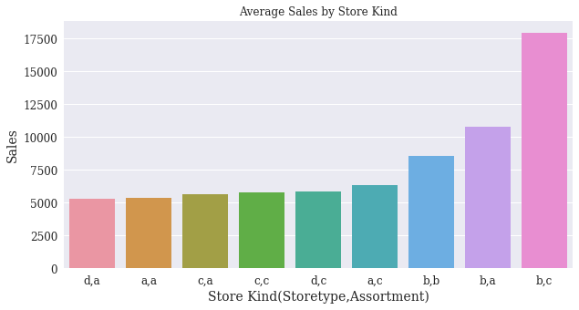

# -Rossmann-Store-Sales Welcome

Abstract: Dirk Rossmann GmbH is Germany's second-largest drug store chain. Rossmann operates over 3,000 drug stores in 7 European countries. Currently, Rossmann store managers are tasked with predicting their daily sales for up to six weeks in advance.Currently, Rossmann store managers are tasked with predicting their daily sales for up to six weeks in advance. Rossmann would not like to suffer the same fate as Schlecker, once Europe's largest drugstore chain and end up [bankrupt](https://www.dw.com/en/schlecker-drugstores-to-close-for-good/a-15996229). In its pursuit to use data analytics to solve their current predicament Rossman provided a training set of daily sales data for 1115 stores in Germany between January 1st 2013 and July 31st, 2015. Of these 1115 stores, 84% (935) of the stores have daily data for every date in the time period, the remaining stores have 80% complete due to being closed for 6 months in 2014 for refurbishment.For each store, for each day we are given some basic information including the number of sales, number of customers, whether the store was open that day, whether there was a promotion running, and whether it was a holiday.In addition to daily data for each store, we have some additionally summary information about the store describing what type of store it is, how close the nearest competition is, when the competition opened, and whether the store participates in ‘continuing and consecutive’ promotions and when those occur. **This notebook uses a xgboost machine learning model trained on the data provided as well as some engineered features to reduce the prediction error of sales for a given day down to 6%**. Furthermore we outline 2 marketing strategies that could help Rossmann maximize its Sales Revenue.

# Example of applicable results from the project

## Changing Store Type:
Rossmann has three different product assortment levels called as basic, extra, and extended. Rossmann also has 4 different store types called a,b,c,and d. Rossmann should investigate whehter only greater assortment levels are the reason for increased sales of store b or if there are other factors like region of the store,
or more specific reasons like product characteristics sold at each of these different store types.

## Promos in stores with less competition and less averege sales:
Short Competition Distance likely indicates the stores are located in metropolitan regions and malls

Frther Competition Distance may indicate semi-urban and rural regions. 
Information aobut customer demographics, specific characteristics of promo days could help uncover some of the underlying factors at work. 

